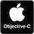

### Languages and tools

[][swiftlang]
[][objclang]
[][c_lang]
[][lldb_debugger]
[][gdb_debugger]
[][docker]
[][frida]

[swiftlang]: https://swift.org/
[objclang]: https://developer.apple.com/library/archive/documentation/Cocoa/Conceptual/ProgrammingWithObjectiveC/Introduction/Introduction.html
[c_lang]: https://en.wikipedia.org/wiki/Dennis_Ritchie
[lldb_debugger]: https://lldb.llvm.org/
[gdb_debugger]: https://www.gnu.org/software/gdb/
[docker]: https://hub.docker.com/
[frida]: https://frida.re/
 
 
 

### Application Security / Reverse Engineering

Link | Description
--|---
[LLDB](https://github.com/rustymagnet3000/lldb_debugger_and_reversing_ios_apps)  | `lldb` debugger commands and scripts.
[GDB](https://github.com/rustymagnet3000/gdb)  | `gdb` commands.
[Frida](https://github.com/rustymagnet3000/frida_scripts)| Tiny `Frida` scripts.
[iOS Static / Dynamic introspection](https://gist.github.com/rustymagnet3000/605c333519cd265c7eac9d556f46dc75)|  written for people learning how to inspect `iOS` apps. Includes `Frida` commands.
[xOS anti-debug playground](https://github.com/rustymagnet3000/anti_debug_playground) |   `LLDB-Python scripts` to bypass anti-debug calls.
[A poor man's RSA Key stealer](https://github.com/rustymagnet3000/poor_man_rsa_secret_stealer) | Decrypt `ciphertext` with a `RSA Public Key`. `macOS` app.
[iOS Debugger Challenge](https://github.com/rustymagnet3000/debugger_challenge) |  For people who wanted to learn `swizzling`, `anti-debug techniques`, `hooking` and `Frida`.  
[xOS Swizzles](https://github.com/rustymagnet3000/reverse_engineer_ios_with_swizzles) | Inspect`URLs, Cookies`, load `dormant code`, bypass`delegates` or `code flow`.
[xOS Port Scanner](https://github.com/rustymagnet3000/ios_macos_poor_port_scanner) | Check for open ports on `macOS` and `iOS`.
[Bits and Bytes playground](https://github.com/rustymagnet3000/bits_bytes_playground) |  `c`, `c++`, `swift`, `Objective-C` and `asm` code.
[Explore vulnerable C APIs](https://github.com/rustymagnet3000/Reverse-Engineering-C-challenges)|  Reverse Engineer challenges. `c / c++`.
[OpenSSL Key Agreement](https://github.com/rustymagnet3000/OpenSSLKeyAgreementECDH) | Two parties want to derive the same `shared secret` over an insecure channel.  Uses `Eliptic Curve Diffie-Hellman` ( `ECDH` ).

### More

  
Code

Link | Description
--|---
[Bits and Bytes playground](https://github.com/rustymagnet3000/bits_bytes_playground) |  `c`, `c++`, `swift`, `Python`, `Objective-C` and `asm` code snippets.
[Beautiful Log Parser](https://github.com/rustymagnet3000/beautifulParser) | `macOS` app written to make reading logs simpler.
[Terminal Log Parser](https://github.com/rustymagnet3000/c_tidy_file_read) | `C` command line log search.
[Docker playground](https://github.com/rustymagnet3000/docker_playground) | `Docker` commands and `Dockerfiles`
[PyOpenSSL playground](https://github.com/rustymagnet3000/python_openssl_playground) |  `Python`modules `PyOpenSSL`and `socket` to print certificates, check for expired certs, verify hostnames, verify certificate chains.
[OpenSSL command line](https://gist.github.com/rustymagnet3000/e1bad38d30827e2f9f68bedc7534084d) |  `OpenSSL` command line reminders.
[OpenSSL playground for iOS](https://github.com/rustymagnet3000/objc_openssl_playground) |  Building and coding with `OpenSSL` for `iOS`.
[WKWebView's WKURLSchemeHandler](https://github.com/rustymagnet3000/WKWebView-and-WKURLSchemeHandler) |  A vanilla `WKWebView` setup versus a `WKWebView WKURLSchemeHandler` setup.
[WKWebView](https://github.com/rustymagnet3000/slim_wkwebview_with_delegates) |  A slim `WKWebView` to understand Apple's rich `WKWebView Delegates` and how `Javascript bridges`.

 
 

  
Languages used

 
 

  
Favorite computer scientists

Link | Description
--|---
[Liz Rice](https://github.com/lizrice) | Container and Kubernetes Security
[Derek Selander](https://github.com/DerekSelander/LLDB) | iOS/macOS Reverse Engineering
[Matthew Green](https://blog.cryptographyengineering.com/) | Cryptography and Privacy
[Mike Ash](https://mikeash.com/) | `Objective-C`
[Ole Begemann](https://oleb.net/) | `Swift`
[Jessie Frazelle](https://blog.jessfraz.com/) | Computer Scientist

 
 

  
GitHub Stats

